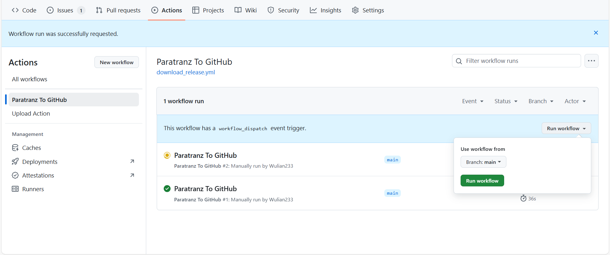

<div align="center">
   <h1>某某项目简体中文翻译</h1>
</div>

| CurseForge     | 加载器     | 整合包版本         | 汉化维护状态 |
| :------------- | :--------- | :----------------- | :----------- |
| [链接](原链接) | 模组加载器 | MC 版本 整合包版本 | 翻译中       |

### 📌 汉化相关

- **汉化项目**：[Paratranz](https://paratranz.cn/projects/项目)
- **汉化发布**：[VM 汉化组官网](https://vmct-cn.top/modpacks/项目)
- **译者名单**：[贡献者排行榜](https://paratranz.cn/projects/项目/leaderboard)

# 📖 整合包介绍

（在这里填写整合包介绍内容……）

# ⚙️ 自动化 Paratranz 同步教程

注：主分支必须叫 `main`！

## 1. 设置环境变量

1. 在仓库顶部导航栏依次进入：
   `Settings -> Environments -> New environment`，新建环境 `PARATRANZ_ENV`。

2. 在该环境中添加 **加密变量（Environment secrets）**：

   | 名称    | 值                                       |
   | ------- | ---------------------------------------- |
   | API_KEY | 你的 Paratranz token，需具备上传文件权限（直接填写原始 token 即可） |
   | CF_API_KEY | 使用 CurseForge API 检查更新时必填；只填写原始 key，不要添加引号 |

   🔑 Token 可在 [Paratranz 用户设置页](https://paratranz.cn/users/my) 获取。
   CurseForge API Key 请按[官方 REST API 文档](https://docs.curseforge.com/rest-api/)申请或生成；文档要求第三方模组服务先申请 API 访问权限。如果工作流返回 HTTP 401/403，说明 CurseForge 未接受该 key；请确认授权或重新生成后，覆盖 `PARATRANZ_ENV` 环境中的 `CF_API_KEY` secret。

3. 在该环境中添加 **环境变量（Environment variables）**：

   | 名称 | 值                              |
   | ---- | ------------------------------- |
   | ID   | Paratranz 项目 ID，例如 `10719` |

## 2. 使用说明

我们目前有两个 GitHub Actions 工作流：

- **Paratranz → GitHub**：从 Paratranz 拉取译文至 GitHub 仓库。
- **GitHub → Paratranz**：将原文内容推送到 Paratranz。

> ✅ 两者均支持手动运行，操作如下图所示：



### 自动运行规则

- **Paratranz → GitHub** 会在北京时间 **每天早上与晚上 10 点左右** 自动执行。
- 下载译文至 GitHub 的功能可通过修改 `.github/workflows/download_release.yml` 内的 `cron 表达式` 自行设定执行时间。

📎 参考：[Cron 表达式教程](https://blog.csdn.net/Stromboli/article/details/141962560)

### 发布与检查机制

- 当有译文更改时，工作流会自动发布一个 **预发布 Release** 供测试。
- 每次同步上游后，会运行一次 **FTB 任务颜色字符检查程序**：

  - **发现错误**：在 Release 说明页面提示，并上传 HTML 报告至 **Artifacts** 和 **Release 页面**。
  - **未发现错误**：工作流详情页会提示找不到报告文件，此属正常情况，无需担心。

⚠️ 注意：

- **GitHub → Paratranz** 的同步任务使用频率较低，仅支持手动触发。
- 若项目已完成，请至仓库 **Settings** 中禁用工作流运行。

### 任务 JSON 仅在 Paratranz 分片

对于 Minecraft 1.20 及以下常见的 JSON 任务语言文件，可以在 `.github/configs/modpack.json` 中配置虚拟分片。GitHub 的 `Source` 和 `CNPack` 仍各自只保留一个完整语言文件；上传时才按规则生成临时 JSON，下载时再按源文件的键顺序合并。

该功能只处理 `jsonSplits` 中明确配置的 `.json` 文件，不会改变现有的 FTB Quests SNBT 拆分、上传、下载或合并逻辑。未配置时，Paratranz 同步行为保持不变。

```jsonc
{
  "paratranz": {
    "jsonSplits": [
      {
        // 相对于仓库 Source 目录的完整源文件路径。
        "path": "resourcepacks/vm_translations/assets/quests/lang/en_us.json",

        // 按顺序匹配；第一个捕获组将成为 Paratranz 上的文件名。
        "groupPatterns": [
          "^ftbquests\\.chapter\\.([^.]+)\\.",
          "^ftbquests\\.([^.]+)\\."
        ],

        // 所有规则都未匹配时使用 general.json。
        "fallbackGroup": "general"
      }
    ],

    // 下载到 CNPack 时进行路径前缀重定向；未匹配的路径保持不变。
    "pathRedirects": [
      {
        "from": "resourcepacks",
        "to": "config/paxi/resourcepacks"
      }
    ]
  }
}
```

以上示例会在 Paratranz 中生成：

```text
resourcepacks/vm_translations/assets/quests/lang/en_us/
├── applied_energistics_2.json
├── chapter_group.json
├── general.json
├── main_story.json
├── reward_table.json
└── ...
```

规则采用 Python 正则表达式，必须至少包含一个捕获组。常用写法如下；写入 JSON 时，表中的每个反斜杠都要写成两个反斜杠，例如 `\.` 写成 `\\.`。

| 语言键示例 | 正则表达式 | 生成的文件 |
| ---------- | ---------- | ---------- |
| `ftbquests.chapter.main_story.quest...` | `^ftbquests\.chapter\.([^.]+)\.` | `main_story.json` |
| `ftbquests.reward_table.loot.title` | `^ftbquests\.([^.]+)\.` | `reward_table.json` |
| `ftbquests.chapter_group.ABCD.title` | `^ftbquests\.([^.]+)\.` | `chapter_group.json` |
| `quest.chapter_01.entry...` | `^quest\.([^.]+)\.` | `chapter_01.json` |
| `mypack.quests.magic.entry...` | `^mypack\.quests\.([^.]+)\.` | `magic.json` |

配置与同步规则：

- `groupPatterns` 按配置顺序匹配，因此应把具体规则放在通用规则前面。上例先提取具体章节，再把 `reward_table`、`chapter_group` 等其他作用域分别归档。
- 未匹配任何规则的键进入 `fallbackGroup`。例如根级键 `ftbquests.title` 会进入 `general.json`。
- 远端目录由源文件名自动派生：`en_us.json` 对应 `en_us/`，无需再配置输出路径。
- 该远端目录由工作流专用。所有新分片上传成功后，工作流会删除其中不再生成的旧 `.json` 分片，并删除原来的远端长文件；不会删除目录外的文件。
- 下载时如果发现未知键、重复键或缺少源文件中的键，工作流会直接失败，不会生成残缺的 GitHub 语言文件。
- `pathRedirects` 只匹配完整路径前缀。例如 `resourcepacks` 不会误匹配 `some_resourcepacks`。多个规则同时可用时，以配置顺序中的第一项为准。
- 首次从远端长文件迁移到分片前，建议先运行一次 Paratranz → GitHub 并备份当前译文。键移动到新文件后，Paratranz 是否保留文件级历史或审核状态取决于平台本身。

# ⚙️ 自动化整合包更新教程

本教程介绍如何配置 Actions 以实现自动检测 CurseForge 上的整合包更新，并创建包含更新文件的PR。

## 1. 首次配置

### 配置 `modpack.json`

在仓库的 `.github/configs/modpack.json` 文件中进行详细配置。此文件是自动化更新脚本的核心。

该文件必须是严格的 JSON，不能保留注释。完成所有配置后，务必把 `configured` 改为 `true`；保留为 `false` 时，更新检查会明确终止，避免模板默认值误更新仓库。

```jsonc
// .github/configs/modpack.json
{
  // [必需] 确认已经完成配置；实际文件中不要保留本示例的注释。
  "configured": true,

  // [必需] 整合包在 CurseForge 上的数字 ID。
  "packId": 130,

  // [必需] 整合包的名称，用于生成 PR 标题等。
  "packName": "FTB StoneBlock 4",

  // [必需] 供选择合适的VMTU使用
  "mcVersion": "1.20.1", 

  // [必需] 供选择合适的VMTU使用
  "loader": "forge",

  // [必需] 存储当前版本信息的文件路径。脚本会读写此文件。
  "infoFilePath": "CNPack/modpackinfo.json",

  // [必需] 存放整合包 `overrides` 目录内容的文件夹路径。
  "sourceDir": "Source",

  // [可选] Paratranz JSON 虚拟分片与下载路径重定向；详见上文。
  "paratranz": {
    "jsonSplits": [],
    "pathRedirects": []
  },
  
  // [必需] 指定检查更新和下载文件的方法。
  // 可选值: "api" (默认) 或 "cursethebeast"。
  // "api" 方法需要配置 CF_API_KEY。
  "updateMethod": "cursethebeast",
  
  // [可选, 仅用于 'api' 方法] 版本号解析模板。
  // 必须与 CurseForge 返回的实际文件名完全对应，并且只包含一个 {version}。
  // 例如文件名 Fractured-4.0.zip 应配置为 Fractured-{version}。
  // 模板不匹配时工作流会停止，避免把完整文件名误写成版本号。
  "versionPattern": "FTB StoneBlock 4 {version}",

  // [可选] "关注列表"，指定脚本只检查特定文件或文件夹的变更，可提高效率。
  // 如果此项为空，则默认对比整个 `sourceDir` 目录。
  "attentionList": {
    "folders": [
      {
        "path": "config/ftbquests/quests", // 检查此文件夹
        "ignoreDeletions": false // 不忽略删除操作
      }
    ],
    "filePatterns": [
      {
        "pattern": "kubejs/assets/*/lang/en_us.json", // 检查匹配此模式的文件
        "ignoreDeletions": true // 忽略删除操作（例如不删除我们自己创建的语言文件）
      }
    ]
  },

  // [可选] "排除模式列表"，用于从变更中排除特定文件。
  "exclusionPatterns": [
    "**/lang/*.*",       // 排除所有语言文件
    "!**/lang/en_us.*"   // 但保留 en_us 语言文件
  ]
}
```

## 2. 工作流说明

- **工作流文件**：`.github/workflows/check_update.yml`
- **触发方式**：默认在北京时间 **每天早上 6 点左右** 自动运行，也支持在 Actions 页面手动触发。

### 自动化流程

1. 工作流按计划或手动启动。
2. 脚本根据 `modpack.json` 的配置，检查 CurseForge 是否有新版本发布。
3. **如果检测到新版本**：
    - 下载新旧两个版本的整合包存档。
    - 对比 `overrides` 目录中的文件差异。
    - 将文件的 **新增、修改、删除** 应用到 `sourceDir` 目录。
    - 更新 `infoFilePath` 中指定的版本号。
    - 创建一个新的分支，并提交所有变更。
    - **自动创建一个PR**，其中包含清晰的变更摘要。
    - 生成一份详细的 HTML 差异报告，并将其链接评论到该 PR 中，供人工审查。
4. **如果未检测到新版本**，工作流正常结束，不执行任何操作。
