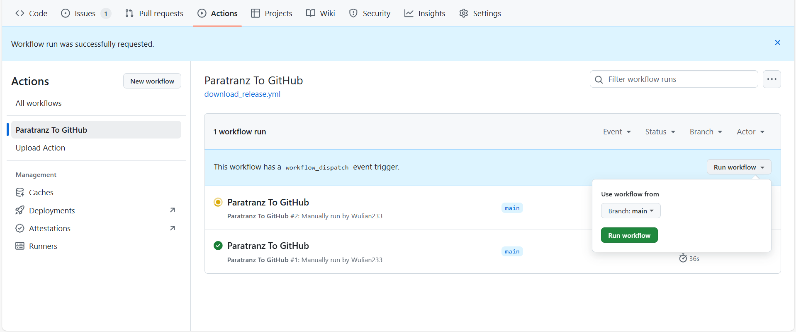

 
   <h1>某某项目简体中文翻译</h1>

CurseForge|加载器|整合包版本|汉化维护状态
:-|:-|:-|:-
[链接](原链接)|模组加载器|mc1.版本 版本|*翻译中*|

---

汉化项目：[Paratranz](https://paratranz.cn/projects/项目)

汉化发布：[VM汉化组官网](https://beta.vmct-cn.top/modpacks/项目)

项目主管 @[某某](https://github.com/某某)

译者：[查看贡献者排行榜](https://paratranz.cn/projects/项目/leaderboard)

---

# 整合包介绍

整合包介绍

# 自动化Paratranz同步教程

## 1. 设置环境变量

1. 到仓库顶部导航栏: `Settings -> Environments -> New environment` 新建 `PARATRANZ_ENV`
2. 添加加密变量（Environment secrets）: 
   | 名称        | 值                                              |
   |-------------|-------------------------------------------------|
   | API_KEY     | 你的个人Paratranz token，须有上传文件权限         |
3. 添加环境变量（Environment variables）: 

   | 名称   | 值                                   |
   |--------|--------------------------------------|
   | ID     | Paratranz项目ID，例如 `10719`         |

## 2. 开始使用

工作流有两种功能：Paratranz同步到github仓库，github仓库同步到Paratranz

其中，Paratranz同步到GitHub仓库工作流每隔2小时，在整点会自动运行。他们也全都可以手动启动，操作方法请见下图：

下载译文至Github功能可自行修改`.github/workflows`文件夹中的`download_release.yml`自动执行时间，格式未cron表达式。
在有新译文后，工作流会自动生成一个artifact构件，可在action的运行页面找到并下载。此外，每天都将自动发布一次Release。

github仓库同步到Paratranz很少使用，仅支持手动触发。
